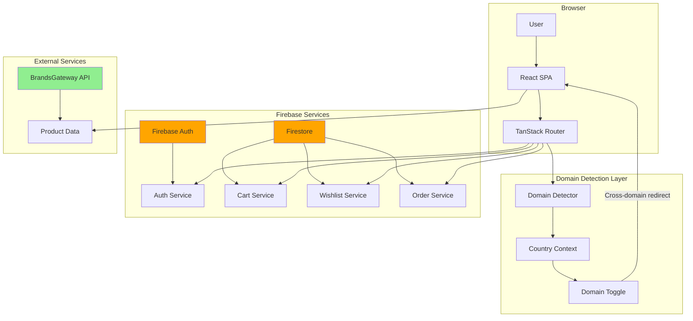
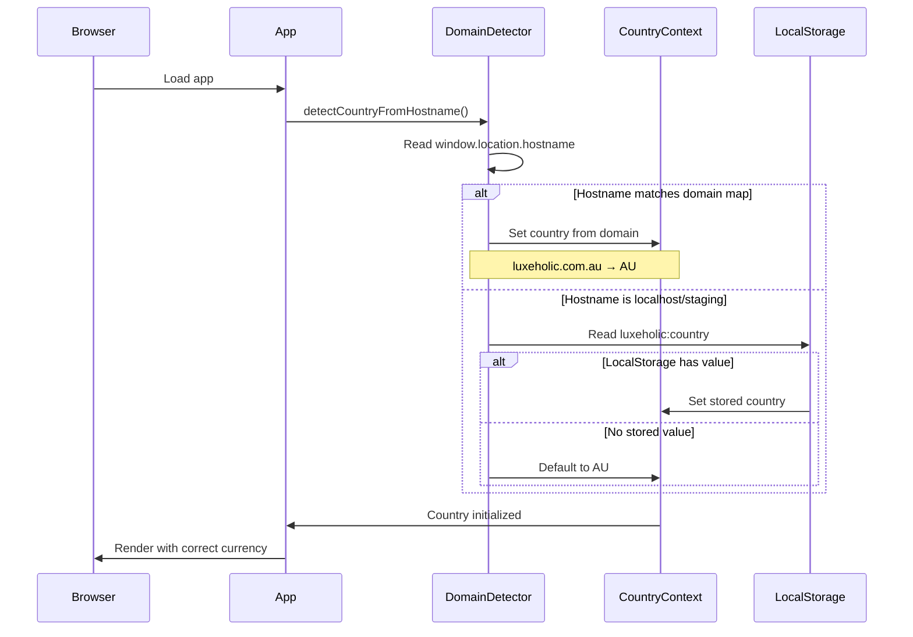
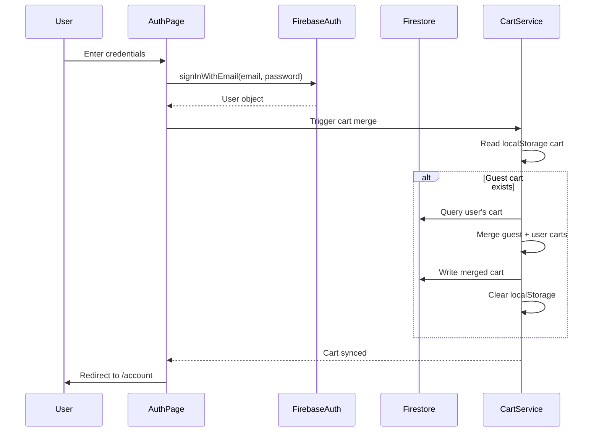
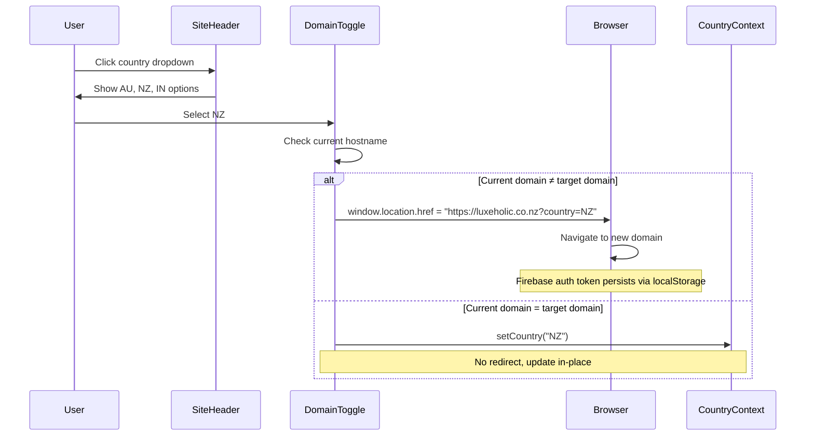

# Design Document: Luxeholic Multi-Domain

## Overview

This design refactors the Luxeholic e-commerce platform to operate seamlessly across three regional domains (`luxeholic.com.au`, `luxeholic.co.nz`, `luxeholic.in`) with unified Firebase Authentication, Firestore-based cart/wishlist/order persistence, domain-aware country detection, and cross-domain redirect capabilities.

### Goals

1. **Unified Authentication**: Replace the split Supabase/Firebase auth with a single Firebase Auth implementation
2. **Firestore Persistence**: Migrate cart, wishlist, and order data from Supabase to Firestore
3. **Domain-Aware Detection**: Automatically detect and set the correct country/currency based on hostname
4. **Cross-Domain Toggle**: Enable users to switch regions with automatic domain redirection
5. **Static SPA Deployment**: Configure Vite build for Hostinger deployment with proper SPA fallback
6. **Dependency Cleanup**: Remove all Supabase dependencies from the codebase

### Non-Goals

- Implementing server-side rendering (SSR) for the Hostinger deployment
- Migrating product catalog data from Supabase (products remain in Supabase/BrandsGateway)
- Implementing multi-currency payment processing (payment integration is out of scope)
- Creating separate Firebase projects per domain (single shared Firebase project)

### Success Metrics

- Zero Supabase authentication calls in production code
- Cart/wishlist data persists across sessions for authenticated users
- Domain detection correctly maps hostname to country 100% of the time
- Cross-domain redirects preserve user context (auth state, intended destination)
- Build output is deployable to Hostinger with working client-side routing


## Architecture

### High-Level Architecture



### Domain Detection Flow




### Authentication Flow




### Cross-Domain Redirect Flow




## Components and Interfaces

### 1. Domain Detector Module

**Location**: `src/lib/domainDetector.ts`

**Purpose**: Maps hostname to country code on app initialization

**Interface**:
```typescript
export type Country = "AU" | "NZ" | "IN";

export interface DomainMap {
  [hostname: string]: Country;
}

export const DOMAIN_MAP: DomainMap = {
  "luxeholic.com.au": "AU",
  "luxeholic.co.nz": "NZ",
  "luxeholic.in": "IN",
};

/**
 * Detects the country code from the current hostname.
 * Falls back to localStorage or "AU" if hostname is not in domain map.
 */
export function detectCountryFromHostname(): Country;
```

**Implementation Notes**:
- Reads `window.location.hostname` in browser environment
- Returns `undefined` in SSR/Node environment (handled by caller)
- Does NOT write to localStorage (that's the responsibility of CountryContext)
- Pure function with no side effects


### 2. Enhanced Country Context

**Location**: `src/lib/country.ts` (existing file, enhanced)

**Changes**:
- Add `detectCountryFromHostname()` call in provider initialization
- Override localStorage value when domain map matches
- Add `getCanonicalDomain(country: Country): string` helper

**Interface**:
```typescript
export interface CountryContextValue {
  country: Country;
  setCountry: (c: Country) => void;
}

/**
 * Returns the canonical domain for a given country code.
 */
export function getCanonicalDomain(country: Country): string;

// Example usage:
// getCanonicalDomain("AU") → "https://luxeholic.com.au"
// getCanonicalDomain("NZ") → "https://luxeholic.co.nz"
// getCanonicalDomain("IN") → "https://luxeholic.in"
```

**Provider Initialization Logic**:
```typescript
const [country, setCountryState] = useState<Country>(() => {
  if (typeof window === "undefined") return "AU";
  
  const detectedCountry = detectCountryFromHostname();
  if (detectedCountry) return detectedCountry;
  
  const stored = localStorage.getItem("luxeholic:country") as Country | null;
  return stored || "AU";
});
```


### 3. Domain Toggle Component

**Location**: `src/components/SiteHeader.tsx` (existing component, enhanced)

**Changes**:
- Add cross-domain redirect logic to country selection handler
- Check if selected country requires domain change
- Preserve current path when redirecting (optional enhancement)

**Implementation**:
```typescript
const handleCountryChange = (newCountry: Country) => {
  const currentHostname = window.location.hostname;
  const targetDomain = getCanonicalDomain(newCountry);
  const targetHostname = new URL(targetDomain).hostname;
  
  if (currentHostname === targetHostname) {
    // Same domain, update context in-place
    setCountry(newCountry);
    setOpenCountry(false);
  } else if (currentHostname === "localhost" || currentHostname.includes("127.0.0.1")) {
    // Development mode, no redirect
    setCountry(newCountry);
    setOpenCountry(false);
  } else {
    // Cross-domain redirect
    const targetUrl = `${targetDomain}${window.location.pathname}${window.location.search}`;
    window.location.href = targetUrl;
  }
};
```


### 4. Firebase Auth Service

**Location**: `src/integrations/firebase/auth.ts` (existing, no changes needed)

**Current Interface** (already implemented):
```typescript
export const signUpWithEmail: (email: string, password: string, displayName?: string) 
  => Promise<{ user: User | null; error: string | null }>;

export const signInWithEmail: (email: string, password: string) 
  => Promise<{ user: User | null; error: string | null }>;

export const signInWithGoogle: () 
  => Promise<{ user: User | null; error: string | null }>;

export const signOutUser: () 
  => Promise<{ error: string | null }>;

export const resetPassword: (email: string) 
  => Promise<{ error: string | null }>;

export const onAuthStateChange: (callback: (user: User | null) => void) => Unsubscribe;

export const getCurrentUser: () => User | null;
```

**Usage in Routes**:
- `routes/auth.tsx`: Replace all Supabase auth calls with `useFirebaseAuth` hook
- `routes/account.tsx`: Replace Supabase user detection with `useFirebaseAuth`
- `components/AuthModal.tsx`: Already uses Firebase (no changes needed)


### 5. Firestore Cart Service

**Location**: `src/lib/cart.ts` (existing file, refactored)

**Interface** (maintains compatibility with existing `useCart` hook):
```typescript
export interface CartLine {
  id: string;
  product_id: string;
  size: string | null;
  color: string | null;
  quantity: number;
  product: {
    id: string;
    name: string;
    slug: string;
    images: string[];
    price_usd: number;
    price_country: Record<string, number>;
    brand?: { name: string } | null;
  };
}

export interface UseCartReturn {
  lines: CartLine[];
  loading: boolean;
  refresh: () => Promise<void>;
  add: (product_id: string, size: string | null, color: string | null, quantity?: number) => Promise<void>;
  remove: (line: CartLine) => Promise<void>;
  updateQty: (line: CartLine, quantity: number) => Promise<void>;
  clear: () => Promise<void>;
  user: User | null;
}

export function useCart(): UseCartReturn;
```

**Firestore Schema**:
```
carts/{userId}/items/{itemId}
  - product_id: string
  - size: string | null
  - color: string | null
  - quantity: number
  - updatedAt: timestamp
```


**Implementation Strategy**:

1. **Guest Cart (localStorage)**:
   - Maintain existing localStorage format for unauthenticated users
   - Key: `luxeholic:cart`
   - Format: `Array<{ product_id, size, color, quantity }>`

2. **Authenticated Cart (Firestore)**:
   - Use subcollection pattern: `carts/{userId}/items/{itemId}`
   - Auto-generate `itemId` using Firestore `addDoc`
   - Store minimal data (product_id, size, color, quantity)
   - Resolve product details from Supabase products table on read

3. **Cart Merge on Sign-In**:
   ```typescript
   async function mergeGuestCart(userId: string) {
     const guestCart = loadLocal();
     if (guestCart.length === 0) return;
     
     // Read user's existing cart from Firestore
     const userCartRef = collection(db, `carts/${userId}/items`);
     const userCartSnap = await getDocs(userCartRef);
     const userCart = userCartSnap.docs.map(doc => ({ id: doc.id, ...doc.data() }));
     
     // Merge logic: add quantities for matching items, insert new items
     for (const guestItem of guestCart) {
       const match = userCart.find(
         item => item.product_id === guestItem.product_id 
              && item.size === guestItem.size 
              && item.color === guestItem.color
       );
       
       if (match) {
         await updateDoc(doc(db, `carts/${userId}/items/${match.id}`), {
           quantity: match.quantity + guestItem.quantity,
           updatedAt: new Date().toISOString(),
         });
       } else {
         await addDoc(userCartRef, {
           ...guestItem,
           updatedAt: new Date().toISOString(),
         });
       }
     }
     
     // Clear guest cart
     localStorage.removeItem("luxeholic:cart");
   }
   ```


### 6. Firestore Wishlist Service

**Location**: `src/lib/wishlist.ts` (new file)

**Interface**:
```typescript
export interface WishlistItem {
  id: string;
  product_id: string;
  addedAt: string;
  product: {
    id: string;
    name: string;
    slug: string;
    images: string[];
    price_usd: number;
    price_country: Record<string, number>;
    brand?: { name: string } | null;
  };
}

export interface UseWishlistReturn {
  items: WishlistItem[];
  loading: boolean;
  add: (product_id: string) => Promise<void>;
  remove: (product_id: string) => Promise<void>;
  toggle: (product_id: string) => Promise<void>;
  isWishlisted: (product_id: string) => boolean;
}

export function useWishlist(): UseWishlistReturn;
```

**Firestore Schema**:
```
wishlists/{userId}/items/{productId}
  - product_id: string (same as document ID for easy lookup)
  - addedAt: timestamp
```

**Implementation Notes**:
- Use `productId` as document ID for O(1) lookup
- Guest wishlist stored in localStorage under `luxeholic:wishlist`
- Merge guest wishlist on sign-in (similar to cart merge)
- `isWishlisted` checks both Firestore and localStorage depending on auth state


### 7. Firestore Order Service

**Location**: `src/lib/orders.ts` (new file)

**Interface**:
```typescript
export interface OrderItem {
  product_id: string;
  product_name: string;
  product_slug: string;
  product_image: string;
  size: string | null;
  color: string | null;
  quantity: number;
  price: number; // Price at time of order in the order's currency
}

export interface Order {
  id: string;
  userId: string;
  country: Country;
  currency: string;
  total: number;
  status: "pending" | "confirmed" | "shipped" | "delivered" | "cancelled";
  items: OrderItem[];
  createdAt: string;
  updatedAt: string;
}

export interface UseOrdersReturn {
  orders: Order[];
  loading: boolean;
  refresh: () => Promise<void>;
}

export function useOrders(): UseOrdersReturn;
```

**Firestore Schema**:
```
orders/{orderId}
  - userId: string (indexed)
  - country: string
  - currency: string
  - total: number
  - status: string
  - items: array<OrderItem>
  - createdAt: timestamp
  - updatedAt: timestamp
```

**Query Pattern**:
```typescript
const ordersRef = collection(db, "orders");
const q = query(
  ordersRef,
  where("userId", "==", user.uid),
  orderBy("createdAt", "desc")
);
const snapshot = await getDocs(q);
```


## Data Models

### Firestore Collections

#### 1. Carts Collection

**Path**: `carts/{userId}/items/{itemId}`

**Document Structure**:
```typescript
{
  product_id: string;        // Foreign key to Supabase products table
  size: string | null;       // e.g., "M", "L", "42", null
  color: string | null;      // e.g., "Black", "Navy", null
  quantity: number;          // Must be >= 1
  updatedAt: string;         // ISO 8601 timestamp
}
```

**Indexes**:
- Composite index on `(userId, product_id, size, color)` for duplicate detection (handled by client-side logic)

**Security Rules**:
```javascript
match /carts/{userId}/items/{itemId} {
  allow read, write: if request.auth != null && request.auth.uid == userId;
}
```


#### 2. Wishlists Collection

**Path**: `wishlists/{userId}/items/{productId}`

**Document Structure**:
```typescript
{
  product_id: string;        // Same as document ID
  addedAt: string;           // ISO 8601 timestamp
}
```

**Security Rules**:
```javascript
match /wishlists/{userId}/items/{productId} {
  allow read, write: if request.auth != null && request.auth.uid == userId;
}
```

#### 3. Orders Collection

**Path**: `orders/{orderId}`

**Document Structure**:
```typescript
{
  userId: string;            // Firebase Auth UID
  country: "AU" | "NZ" | "IN";
  currency: "AUD" | "NZD" | "INR";
  total: number;             // Total in the specified currency
  status: "pending" | "confirmed" | "shipped" | "delivered" | "cancelled";
  items: Array<{
    product_id: string;
    product_name: string;
    product_slug: string;
    product_image: string;
    size: string | null;
    color: string | null;
    quantity: number;
    price: number;           // Price per unit at time of order
  }>;
  createdAt: string;         // ISO 8601 timestamp
  updatedAt: string;         // ISO 8601 timestamp
}
```

**Indexes**:
- Single-field index on `userId` (ascending)
- Single-field index on `createdAt` (descending)

**Security Rules**:
```javascript
match /orders/{orderId} {
  allow read: if request.auth != null && request.auth.uid == resource.data.userId;
  allow create: if request.auth != null && request.auth.uid == request.resource.data.userId;
  allow update: if false; // Orders are immutable after creation
  allow delete: if false; // Orders cannot be deleted
}
```


### LocalStorage Schemas

#### Guest Cart

**Key**: `luxeholic:cart`

**Format**:
```typescript
Array<{
  product_id: string;
  size: string | null;
  color: string | null;
  quantity: number;
}>
```

#### Guest Wishlist

**Key**: `luxeholic:wishlist`

**Format**:
```typescript
Array<{
  product_id: string;
  addedAt: string;
}>
```

#### Country Preference

**Key**: `luxeholic:country`

**Format**: `"AU" | "NZ" | "IN"` (string)

**Note**: This value is overridden by domain detection on production domains.


## Correctness Properties

*A property is a characteristic or behavior that should hold true across all valid executions of a system—essentially, a formal statement about what the system should do. Properties serve as the bridge between human-readable specifications and machine-verifiable correctness guarantees.*

### Property Reflection

From the prework analysis, I identified the following properties suitable for property-based testing:

1. **Cart item deduplication** (2.3, 2.3a): Adding the same item twice should merge quantities
2. **Wishlist toggle idempotence** (3.4): Toggling twice returns to original state
3. **Cart merge correctness** (2.9): Merging guest and user carts preserves all items
4. **Wishlist merge correctness** (3.6): Merging guest and user wishlists preserves all items
5. **Domain mapping** (5.1): Hostname to country mapping is correct
6. **Price formatting consistency** (5.7): Currency and locale always match country
7. **Price fallback calculation** (7.6): Fallback multiplier applied correctly

**Redundancy Analysis**:
- Properties 3 and 4 (cart merge and wishlist merge) follow the same pattern and can be kept separate as they test different services
- Property 1 applies to both authenticated and guest carts but tests the same behavior, so can be combined
- Properties 5, 6, and 7 all relate to country/pricing but test different aspects, so should be kept separate

**Final Properties** (after reflection):


### Property 1: Cart Item Deduplication

*For any* cart (authenticated or guest) and any cart item (product_id, size, color), adding the same item multiple times SHALL result in a single cart entry with quantity equal to the sum of all additions, rather than creating duplicate entries.

**Validates: Requirements 2.3, 2.3a**

### Property 2: Wishlist Toggle Idempotence

*For any* wishlist (authenticated or guest) and any product_id, toggling the product twice SHALL return the wishlist to its original state (if initially wishlisted, it remains wishlisted; if initially not wishlisted, it remains not wishlisted).

**Validates: Requirements 3.4**

### Property 3: Cart Merge Preservation

*For any* guest cart and any user cart, merging the guest cart into the user cart SHALL preserve all unique items from both carts, with quantities summed for items that appear in both carts with matching product_id, size, and color.

**Validates: Requirements 2.9**

### Property 4: Wishlist Merge Preservation

*For any* guest wishlist and any user wishlist, merging the guest wishlist into the user wishlist SHALL preserve all unique product_ids from both wishlists, with no duplicates in the final merged wishlist.

**Validates: Requirements 3.6**

### Property 5: Domain Mapping Correctness

*For any* hostname in the DOMAIN_MAP, calling `detectCountryFromHostname()` with that hostname SHALL return the corresponding Country code as defined in the map (`luxeholic.com.au` → `AU`, `luxeholic.co.nz` → `NZ`, `luxeholic.in` → `IN`).

**Validates: Requirements 5.1**


### Property 6: Price Formatting Consistency

*For any* Country code and any monetary amount, calling `formatPrice(country, amount)` SHALL use the currency code and locale that match the Country code as defined in the COUNTRIES map (AU → AUD/en-AU, NZ → NZD/en-NZ, IN → INR/en-IN).

**Validates: Requirements 5.7**

### Property 7: Price Fallback Calculation

*For any* Country code and any product that lacks a `price_country` entry for that country, calling `priceFor(country, null, price_usd)` SHALL return a price calculated by applying the correct fallback multiplier to `price_usd` (AU: 1.55, NZ: 1.70, IN: 84).

**Validates: Requirements 7.6**


## Error Handling

### Firebase Authentication Errors

**Error Sources**:
- Invalid credentials (wrong email/password)
- Email already in use (sign-up)
- Weak password
- Network failures
- Google OAuth popup blocked/cancelled
- Password reset email not found

**Handling Strategy**:
1. All Firebase auth functions return `{ user, error }` or `{ error }` format
2. Errors are displayed inline on the auth form without navigation
3. Error messages use Firebase's built-in error messages (e.g., `error.message`)
4. Loading states prevent duplicate submissions
5. Network errors show retry option

**Example Error Display**:
```typescript
if (result.error) {
  toast.error(result.error); // or inline form error
  return;
}
```


### Firestore Write Errors

**Error Sources**:
- Permission denied (security rules)
- Network failures
- Quota exceeded
- Invalid document structure

**Handling Strategy**:
1. All Firestore operations wrapped in try-catch
2. Failed writes display toast notification to user
3. Local state remains unchanged on failure (optimistic updates rolled back)
4. Retry mechanism for transient network errors
5. Graceful degradation: guest cart/wishlist continues to work in localStorage

**Example Error Handling**:
```typescript
try {
  await addDoc(collection(db, `carts/${userId}/items`), cartItem);
  // Update local state
} catch (error) {
  toast.error("Failed to add item to cart. Please try again.");
  // Rollback optimistic update
  return;
}
```

### Domain Detection Errors

**Error Sources**:
- `window` undefined (SSR context)
- Unexpected hostname format

**Handling Strategy**:
1. Fallback chain: domain map → localStorage → default "AU"
2. No errors thrown, always returns a valid Country code
3. Development hostnames (localhost, 127.0.0.1) handled explicitly


### Cross-Domain Redirect Errors

**Error Sources**:
- Popup blockers preventing redirect
- Invalid URL construction
- Auth token not persisting across domains

**Handling Strategy**:
1. Use `window.location.href` assignment (not `window.open`) to avoid popup blockers
2. Validate URL construction before redirect
3. Firebase Auth persistence set to `browserLocalStorage` (default) ensures token survives redirect
4. Append `?country={code}` query param for debugging/confirmation
5. If auth doesn't persist, user can sign in again (Firebase session should restore)

### Product Data Loading Errors

**Error Sources**:
- Supabase/BrandsGateway API failures
- Product not found
- Network timeouts

**Handling Strategy**:
1. Cart/wishlist items with missing product data show placeholder
2. Retry mechanism for transient failures
3. Stale product data cached in cart/wishlist documents (product_name, product_image) for display even if product fetch fails
4. Error boundaries prevent full app crash


## Testing Strategy

### Overview

This feature requires a **dual testing approach** combining property-based tests for universal correctness properties with example-based unit tests for specific scenarios, edge cases, and integration points.

### Property-Based Testing

**Library**: `fast-check` (JavaScript/TypeScript property-based testing library)

**Configuration**:
- Minimum 100 iterations per property test
- Each test tagged with comment referencing design property
- Tag format: `// Feature: luxeholic-multi-domain, Property {number}: {property_text}`

**Properties to Test**:

1. **Cart Item Deduplication** (Property 1)
   - Generator: Random cart items with varying product_id, size, color, quantity
   - Test: Add same item multiple times, verify single entry with summed quantity
   - Applies to both authenticated (Firestore) and guest (localStorage) carts

2. **Wishlist Toggle Idempotence** (Property 2)
   - Generator: Random wishlist states and product_ids
   - Test: Toggle product twice, verify original state restored
   - Applies to both authenticated and guest wishlists

3. **Cart Merge Preservation** (Property 3)
   - Generator: Random guest cart and user cart with overlapping and unique items
   - Test: Merge carts, verify all items present with correct quantities
   - Mock Firestore operations

4. **Wishlist Merge Preservation** (Property 4)
   - Generator: Random guest wishlist and user wishlist with overlapping and unique items
   - Test: Merge wishlists, verify all unique product_ids present
   - Mock Firestore operations

5. **Domain Mapping Correctness** (Property 5)
   - Generator: Hostnames from DOMAIN_MAP
   - Test: Verify correct Country code returned for each hostname
   - Pure function test, no mocks needed

6. **Price Formatting Consistency** (Property 6)
   - Generator: Random Country codes and amounts
   - Test: Verify formatPrice uses correct currency and locale from COUNTRIES map
   - Pure function test, no mocks needed

7. **Price Fallback Calculation** (Property 7)
   - Generator: Random Country codes and USD prices
   - Test: Verify priceFor applies correct multiplier when price_country is null
   - Pure function test, no mocks needed


### Unit Testing

**Framework**: Vitest (already configured in project)

**Test Categories**:

1. **Authentication Tests**:
   - Sign-up with valid credentials creates user
   - Sign-in with valid credentials returns user
   - Sign-in with invalid credentials returns error
   - Google OAuth popup flow (mocked)
   - Password reset sends email (mocked)
   - Sign-out clears user state
   - Error messages displayed correctly
   - Auth state propagation within 500ms

2. **Cart Service Tests**:
   - Add item to authenticated cart writes to Firestore
   - Add item to guest cart writes to localStorage
   - Remove item deletes from Firestore/localStorage
   - Update quantity updates Firestore/localStorage
   - Update quantity to 0 deletes item
   - Clear cart removes all items
   - Firestore write failure shows error and preserves state

3. **Wishlist Service Tests**:
   - Add item to authenticated wishlist writes to Firestore
   - Add item to guest wishlist writes to localStorage
   - Remove item deletes from Firestore/localStorage
   - Toggle wishlisted item removes it
   - Toggle non-wishlisted item adds it
   - Firestore write failure shows error and preserves state

4. **Domain Detection Tests**:
   - Known hostname returns correct country
   - Unknown hostname falls back to localStorage
   - No localStorage falls back to "AU"
   - Localhost/127.0.0.1 handled correctly

5. **Domain Toggle Tests**:
   - Selecting different domain triggers redirect
   - Selecting same domain updates context only
   - Localhost mode updates context without redirect
   - Redirect URL includes country query param
   - Active country shows visual indicator

6. **Order Service Tests**:
   - Query returns user's orders ordered by createdAt desc
   - Empty orders shows empty state message
   - Non-empty orders shows order list

7. **Price Display Tests**:
   - AU country formats prices in AUD
   - NZ country formats prices in NZD
   - IN country formats prices in INR
   - Country change triggers total recalculation


### Integration Testing

**Test Categories**:

1. **Firebase Auth Integration**:
   - Real Firebase auth operations in test environment
   - Auth state persistence across page reloads
   - Google OAuth flow (manual testing)

2. **Firestore Integration**:
   - Real Firestore writes/reads in test environment
   - Security rules enforcement
   - Query performance with realistic data volumes

3. **Cross-Domain Auth Persistence**:
   - Manual browser testing across domains
   - Verify auth token persists via localStorage
   - Verify user remains signed in after domain switch

4. **SPA Fallback**:
   - Direct navigation to /shop, /cart, /product/slug serves index.html
   - TanStack Router handles route client-side
   - 404 for non-existent routes

### End-to-End Testing

**Scenarios**:

1. **Guest to Authenticated User Journey**:
   - Add items to cart as guest
   - Add items to wishlist as guest
   - Sign in
   - Verify cart and wishlist merged correctly
   - Verify localStorage cleared

2. **Cross-Domain Shopping Journey**:
   - Browse products on luxeholic.com.au
   - Add items to cart
   - Switch to luxeholic.co.nz via domain toggle
   - Verify auth persists
   - Verify cart persists
   - Verify prices displayed in NZD

3. **Order History Journey**:
   - Sign in
   - Place order (mock payment)
   - Navigate to /account
   - Verify order appears in history
   - Verify order details correct

### Smoke Testing

**Build and Deployment**:
- `vite build` completes without errors
- `dist/` directory contains index.html and assets
- `.htaccess` file present in dist/
- TypeScript compilation succeeds with no Supabase-related errors
- No `@supabase/supabase-js` in package.json
- Firebase environment variables injected correctly


### Test Mocking Strategy

**Firebase Auth Mocks**:
```typescript
// Mock Firebase auth for unit tests
vi.mock("@/integrations/firebase/auth", () => ({
  signInWithEmail: vi.fn(),
  signUpWithEmail: vi.fn(),
  signInWithGoogle: vi.fn(),
  signOutUser: vi.fn(),
  resetPassword: vi.fn(),
  onAuthStateChange: vi.fn(),
  getCurrentUser: vi.fn(),
}));
```

**Firestore Mocks**:
```typescript
// Mock Firestore operations for unit tests
vi.mock("@/integrations/firebase/firestore", () => ({
  createDocument: vi.fn(),
  getDocument: vi.fn(),
  getDocuments: vi.fn(),
  updateDocument: vi.fn(),
  deleteDocument: vi.fn(),
  setDocument: vi.fn(),
}));
```

**Window/Location Mocks**:
```typescript
// Mock window.location for domain detection tests
Object.defineProperty(window, "location", {
  value: { hostname: "luxeholic.com.au", href: "", pathname: "", search: "" },
  writable: true,
});
```

**LocalStorage Mocks**:
```typescript
// Mock localStorage for guest cart/wishlist tests
const localStorageMock = {
  getItem: vi.fn(),
  setItem: vi.fn(),
  removeItem: vi.fn(),
  clear: vi.fn(),
};
global.localStorage = localStorageMock as any;
```


## Deployment Configuration

### Vite Build Configuration

**File**: `vite.config.ts`

**Required Changes**:
```typescript
import { defineConfig } from "vite";
import react from "@vitejs/plugin-react";
import path from "path";

export default defineConfig({
  plugins: [react()],
  resolve: {
    alias: {
      "@": path.resolve(__dirname, "./src"),
    },
  },
  build: {
    outDir: "dist",
    emptyOutDir: true,
    sourcemap: false, // Disable for production
    rollupOptions: {
      output: {
        manualChunks: {
          vendor: ["react", "react-dom", "@tanstack/react-router"],
          firebase: ["firebase/app", "firebase/auth", "firebase/firestore"],
        },
      },
    },
  },
});
```


### .htaccess Configuration

**File**: `public/.htaccess` (copied to `dist/` during build)

**Content**:
```apache
<IfModule mod_rewrite.c>
  RewriteEngine On
  RewriteBase /
  
  # Don't rewrite files or directories
  RewriteCond %{REQUEST_FILENAME} !-f
  RewriteCond %{REQUEST_FILENAME} !-d
  
  # Rewrite everything else to index.html to allow client-side routing
  RewriteRule ^ index.html [L]
</IfModule>

# Enable GZIP compression
<IfModule mod_deflate.c>
  AddOutputFilterByType DEFLATE text/html text/plain text/xml text/css text/javascript application/javascript application/json
</IfModule>

# Set cache headers for static assets
<IfModule mod_expires.c>
  ExpiresActive On
  ExpiresByType image/jpg "access plus 1 year"
  ExpiresByType image/jpeg "access plus 1 year"
  ExpiresByType image/gif "access plus 1 year"
  ExpiresByType image/png "access plus 1 year"
  ExpiresByType image/webp "access plus 1 year"
  ExpiresByType text/css "access plus 1 month"
  ExpiresByType application/javascript "access plus 1 month"
  ExpiresByType application/pdf "access plus 1 month"
  ExpiresByType image/x-icon "access plus 1 year"
</IfModule>
```

**Build Script Update** (`package.json`):
```json
{
  "scripts": {
    "build": "vite build && cp public/.htaccess dist/.htaccess"
  }
}
```

